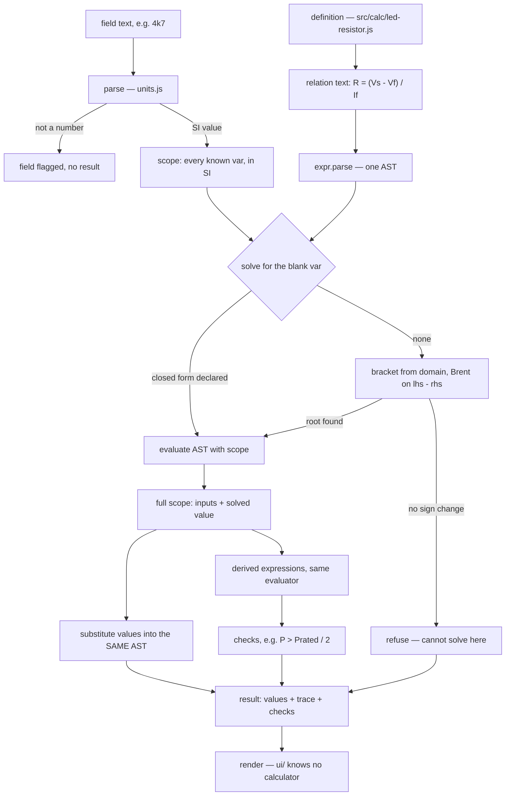
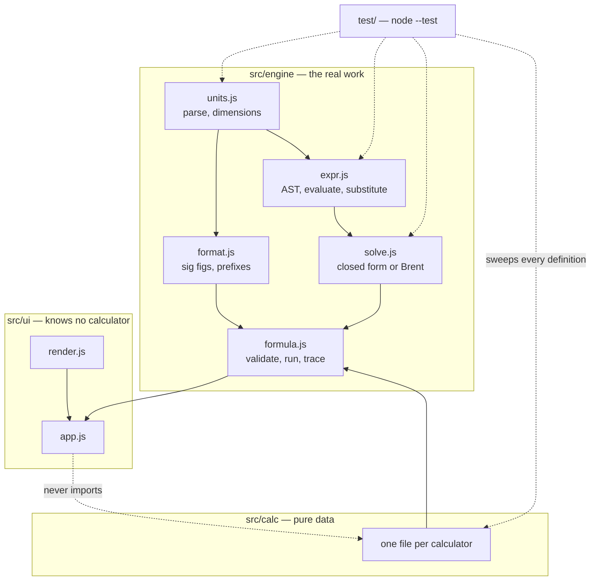
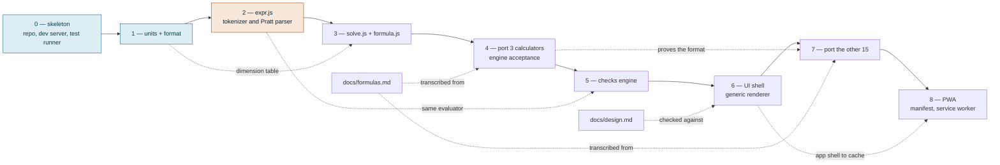

# Architecture

Three views of the same idea: a formula is written once, as text, and parsed.

All diagrams below are mermaid and validated — GitHub renders them inline, and
Obsidian renders them with the mermaid block it already supports.

## How a result is computed

The path a keystroke takes. Note that `substitute` and `evaluate` walk the
**same AST**: the worked arithmetic under a result cannot disagree with the
result, because it is the result, printed differently.

Two branches matter more than the happy path:

- **`not a number`** — a bad field produces a flagged field, never a result
  computed from `NaN` that renders as a dash and gets ignored.
- **`no sign change`** — the numeric solver refuses rather than returning one of
  several roots. A confident wrong number is the worst output a bench tool can
  produce.

## Module dependencies

`src/ui` never imports `src/calc`. If the UI needs to special-case a
calculator, the definition format is missing something — fix the format.

## Build phases

Solid arrows are order. Dotted arrows are why the order is what it is.
Phases 0 and 1 are done; 2 is next.

Phase exit criteria are in `PLAN.md`. The rule behind the whole chart: nothing
is built on an unproven layer, and a phase with failing tests is not finished.
